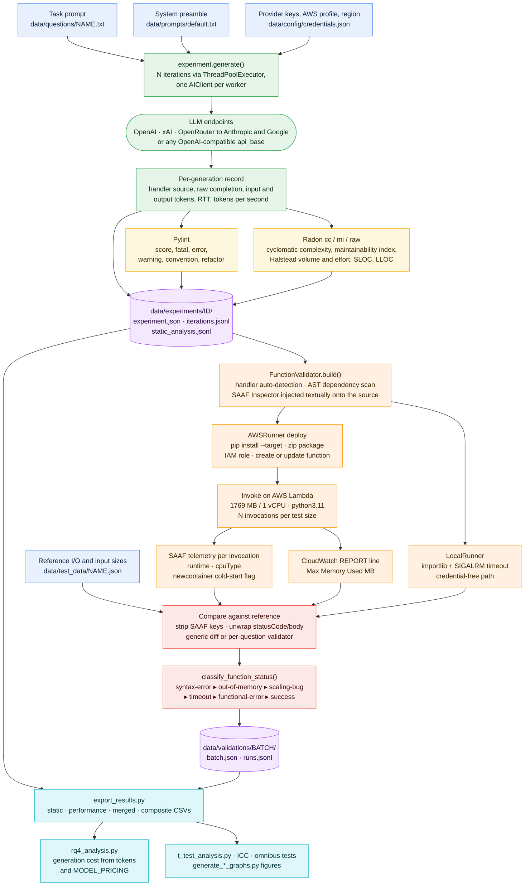
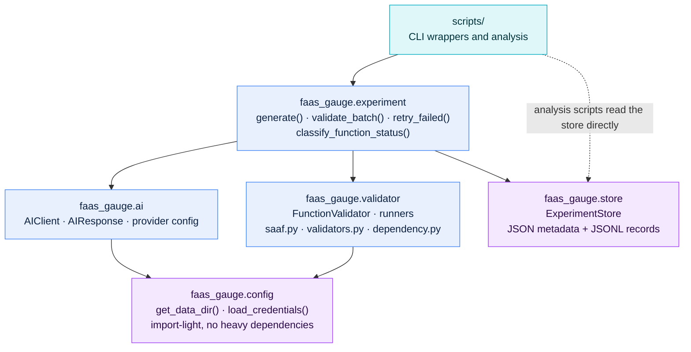
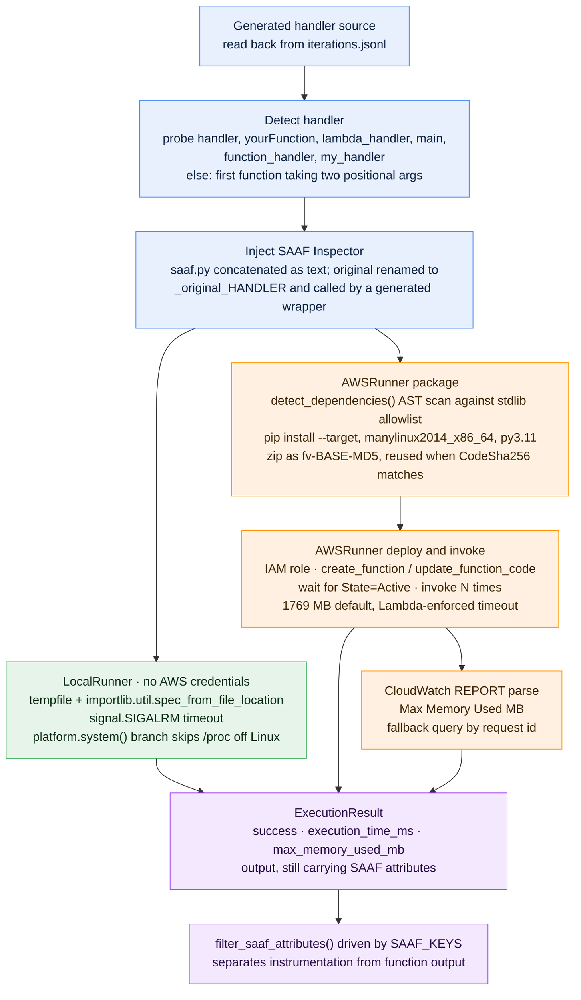
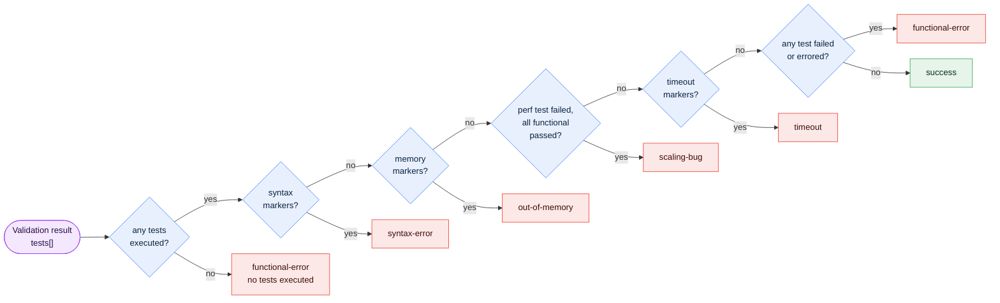
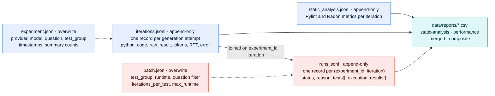

# FaaS-GAUGE Architecture

FaaS-GAUGE turns a natural-language programming prompt into a **deployed, measured** AWS Lambda
function. Where conventional code-generation benchmarks stop at "does the code produce the right
answer on a developer machine", FaaS-GAUGE carries every generation through to a real serverless
deployment and records what that code actually costs to run.

This document is the design overview of the benchmark: the end-to-end pipeline, the module layering
behind it, how instrumentation is attached to generated code, and where every measurement lands on
disk.

- [1. End-to-end pipeline](#1-end-to-end-pipeline)
- [2. Stage reference](#2-stage-reference)
- [3. Package layering](#3-package-layering)
- [4. Execution backends and SAAF instrumentation](#4-execution-backends-and-saaf-instrumentation)
- [5. Correctness classification](#5-correctness-classification)
- [6. On-disk data model](#6-on-disk-data-model)
- [7. Metrics catalogue](#7-metrics-catalogue)
- [8. Cost model](#8-cost-model)
- [9. Extension points](#9-extension-points)

---

## 1. End-to-end pipeline

One pass of the benchmark takes a `(prompt, LLM)` pair and produces `N` independently generated
functions, each of which is statically analysed, deployed, executed under instrumentation, checked
for correctness, and priced.



<sub>Blue = benchmark inputs · green = LLM generation · yellow = static analysis · orange = deploy and
execute · red = correctness · purple = result store · teal = analysis and reporting.</sub>

Two properties of this pipeline are worth calling out, because they are what make repeated runs
comparable:

- **Generation and measurement are decoupled.** Generation writes an immutable append-only record;
  validation reads it back and writes a *separate* batch. A generation can therefore be re-validated
  under a different memory size, timeout, or runtime without regenerating code, and a failed
  validation never mutates the generation record. This is why the store sits in the middle of the
  figure rather than at the end — it is the hand-off between the two halves of the benchmark, not a
  terminal sink.
- **Every stage is resumable.** `validate_batch()` finds prior batches matching
  `(test_group, runtime, question_filter, iterations_per_test)` and skips any `(experiment_id, iteration)`
  already recorded, so an interrupted AWS run continues instead of restarting. Pass `skip_resume=True`
  to force re-validation.

---

## 2. Stage reference

| Stage | Entry point | Implementation | Writes |
|---|---|---|---|
| 1 · Inputs | — | `data/questions/`, `data/prompts/`, `data/test_data/`, `data/config/` | — |
| 2 · Generation | `scripts/generate.py` | `faas_gauge.experiment.generate` → `faas_gauge.ai.AIClient` | `experiment.json`, `iterations.jsonl` |
| 3 · Static analysis | `scripts/static_analysis.py` | `pylint` + `radon` via subprocess | `static_analysis.jsonl` |
| 4 · Build and deploy | `scripts/validate.py` | `faas_gauge.validator.FunctionValidator` → `AWSRunner` / `LocalRunner` | — (ephemeral Lambda) |
| 5 · Execution | same | `AWSRunner.execute()`, SAAF `Inspector`, CloudWatch logs client | — |
| 6 · Correctness | same | `experiment.validate_batch` + `validator.validators` + `experiment.classify` | `batch.json`, `runs.jsonl` |
| 7 · Storage | — | `faas_gauge.store.ExperimentStore` | see [§6](#6-on-disk-data-model) |
| 8 · Analysis | `scripts/export_results.py`, `scripts/rq4_analysis.py`, `scripts/generate_*_graphs.py` | read-only over the store | `data/reports/` |

`scripts/run_weekly_test.sh` chains stages 2 → 3 → 5/6 → 8 for a whole week's matrix of
`(question × model)` pairs, launching the generation step for every pair in parallel.

---

## 3. Package layering

The package is strictly layered. Imports only ever point downward — `experiment` may reach into
`ai`, `store`, and `validator`; none of those may reach back up.



Why it is arranged this way:

- **`config` is deliberately dependency-free.** It imports neither `openai` nor `boto3` nor `yaml`,
  so `import faas_gauge.config` stays cheap for analysis scripts that only need to locate `data/`.
- **`ai` never raises out of `ask()`.** Provider errors are caught and returned as
  `AIResponse(error=..., input_tokens=0, output_tokens=0)`, so a rate limit on iteration 4 of 10 does
  not abort the batch.
- **`store` is a true leaf** — it imports nothing from the rest of the package, not even `config`;
  callers pass it a resolved `data_dir`. No database, no ORM, just JSON and JSONL under `data/`, which
  keeps the whole dataset diffable, `rsync`-able, and reviewable in a pull request.
- **`validator` knows nothing about experiments.** It validates *a Python file* against *a test
  payload*; the experiment layer is what maps that onto stored iterations.

---

## 4. Execution backends and SAAF instrumentation

`FunctionValidator` drives a fixed lifecycle — `build → execute → iterate → compare → cleanup` — over
one of two interchangeable runners.



**SAAF injection is textual, not an import.** The runner reads `faas_gauge/validator/saaf.py` as a
string and concatenates it onto the generated code, then emits a wrapper `def HANDLER(request, context)`
that calls the renamed original. This is what lets an arbitrary LLM-generated file — which knows
nothing about the harness — return platform telemetry alongside its own result. It also means
`saaf.py` must stay self-contained: no package-relative imports.

**`SAAF_KEYS` in `validator/utils.py` is the contract** between instrumentation and correctness
checking. It is the single source of truth for "which keys in the response are harness noise rather
than function output". Adding an attribute to `Inspector` without adding it to `SAAF_KEYS` silently
leaks instrumentation into the comparison and corrupts correctness results.

The two runners exist for different purposes: `LocalRunner` is the fast, credential-free path used by
the test suite and for smoke-checking a new question, while `AWSRunner` is the measurement path — all
published runtime and memory numbers come from real Lambda invocations.

---

## 5. Correctness classification

Each generation receives exactly **one** status. Conditions are evaluated as a priority ladder, so a
generation that both fails to parse and times out is a `syntax-error`, not a `timeout`.



The marker tests match against the concatenation of every test message and every execution error,
lower-cased:

| Condition | Matched on |
|---|---|
| syntax markers | `syntaxerror`, `indentationerror`, `taberror`, `invalid syntax`, `failed to parse` |
| memory markers | `memoryerror`, `out of memory`, `outofmemory`, `oom`, `runtime exited with error: signal: killed`, `process exited before completing request` |
| timeout markers | `timed out`, `time out`, `timeout`, `task timed out`, `function execution timed out` |

`scaling-bug` is the class that separates *algorithmic-complexity* defects from outright
incorrectness: the function returns the right answer on the small input but fails at scale. It fires
only when every non-performance test passed **and** at least one performance-sized test failed.
Performance tests are identified by name — `is_performance_test()` matches any test whose name starts
with `performance`, generated by expanding a question's declared input sizes.

Comparison itself is tolerant in two deliberate ways: numeric outputs use an absolute tolerance
(default `1e-5`), and Lambda proxy-style responses (`{"statusCode": 200, "body": "..."}`) are unwrapped
before comparison so a generation that mimics API Gateway output is not penalised for it. Questions
with non-deterministic output register a bespoke checker in `validator/validators.py` under the
signature `(actual, expected, optional_arg) -> (bool, str)`.

> **Ordering is load-bearing.** `classify_function_status` is a pure function, and changing the
> priority order silently relabels every historical result. Treat the order as a versioned interface.

---

## 6. On-disk data model

There is no database. Everything is plain files, chosen so the dataset stays git-friendly and
directly readable by notebooks and analysis scripts.

```
data/
├── experiments/
│   └── {YYYYMMDD_HHMM}+{question}+{provider}+{model}/
│       ├── experiment.json          # overwrite   — run metadata and summary
│       ├── iterations.jsonl         # append-only — one record per generation
│       └── static_analysis.jsonl    # append-only — Pylint + Radon per iteration
├── validations/
│   └── {batch_id}/
│       ├── batch.json               # overwrite   — batch parameters
│       └── runs.jsonl               # append-only — one record per (experiment, iteration)
└── reports/                         # CSV exports (read-only consumers)
```



Conventions that the rest of the system relies on:

- **Experiment ID:** `{YYYYMMDD_HHMM}+{question}+{safe_provider}+{safe_model}`, with `/` rewritten to
  `-` for path safety and `__{suffix}` appended on collision. The raw provider and model strings are
  preserved inside `experiment.json` — the rewrite affects only the directory name.
- **JSONL is append-only.** Metadata JSON is overwritten; record streams never are. The single
  in-place rewriter is `experiment/retry.py`, which dedupes by iteration number after re-running
  errored generations.
- **Writes take a per-file `threading.Lock`.** That covers the in-process `ThreadPoolExecutor` used by
  generation and static analysis; it is *not* multi-process safe.
- **Field names are a public interface.** Notebooks, `export_results.py`, and the analysis scripts read
  these files directly, so renaming a key is a breaking change even though no schema is enforced.
- **Analysis scripts are read-only.** They must not write under `data/experiments/` or
  `data/validations/`. The one deliberate exception is `static_analysis.py`, which co-locates
  `static_analysis.jsonl` inside each experiment directory so analysis output travels with its source.

---

## 7. Metrics catalogue

| Metric | Produced by | Stored in |
|---|---|---|
| Input tokens, output tokens, round-trip time, tokens per second | `AIClient.ask()` | `iterations.jsonl` |
| Generated source, raw completion, provider error | `AIClient.ask()` | `iterations.jsonl` |
| Pylint score; fatal / error / warning / convention / refactor counts | `pylint` | `static_analysis.jsonl` |
| Cyclomatic complexity, maintainability index | `radon cc`, `radon mi` | `static_analysis.jsonl` |
| Halstead volume and effort, SLOC, LLOC | `radon raw` | `static_analysis.jsonl` |
| Wall-clock runtime per invocation | `ExecutionResult.execution_time_ms` | `runs.jsonl` |
| Peak memory used (MB) | CloudWatch `REPORT` line | `runs.jsonl` |
| CPU model, cold-start flag, container UUID | SAAF `Inspector` (`cpuType`, `newcontainer`, `uuid`) | `runs.jsonl` → `execution_results[].output` |
| Functional status and reason | `classify_function_status()` | `runs.jsonl` |
| Generation cost (USD) | `scripts/rq4_analysis.py` | `data/reports/` |

Because `cpuType` and `newcontainer` are captured on **every** invocation rather than aggregated away,
downstream analysis can filter to a single CPU family and to warm-state executions — the two largest
sources of runtime variance on Lambda — without rerunning the benchmark.

---

## 8. Cost model

FaaS-GAUGE measures both halves of the cost of using an LLM to write serverless code.

**Generation cost** — implemented in `scripts/rq4_analysis.py`:

```
generation_cost = input_tokens  × input_price_per_1M  / 1e6
                + output_tokens × output_price_per_1M / 1e6
```

Per-model prices live in the `MODEL_PRICING` table in `scripts/rq4_analysis.py`, keyed by
`"provider+model"`. **This table is not shared with `scripts/run_weekly_test.sh`** — adding a model to
the weekly driver without adding it to `MODEL_PRICING` silently drops that model from every cost
report.

**Execution cost** — derived from AWS Lambda's GB-second billing:

```
execution_cost = avg_runtime_seconds × (memory_MB / 1024) × price_per_GB_second
```

at `$0.00001667` per GB-second for x86_64. The repository *measures and stores* both inputs to this
formula — `execution_time_ms` and the configured memory size (default 1769 MB) — per invocation in
`runs.jsonl`; the GB-second derivation itself is performed in the analysis layer rather than by a
bundled script.

The two halves move in opposite directions, which is the point: a cheaper model may generate code
that is slower and more memory-hungry, and the cost of that inefficiency recurs on every invocation
while the generation cost is paid once.

---

## 9. Extension points

**Adding a question** touches five places:

1. `data/questions/{name}.txt` — the natural-language prompt.
2. `data/test_data/{name}.json` — reference I/O pairs, plus `sizes` / `size_tests` if the question
   should be evaluated at multiple input scales.
3. `faas_gauge/validator/validators.py` — optional, only when generic comparison is insufficient
   (non-deterministic or multi-valid output). Register under `VALIDATORS` with the signature
   `(actual, expected, optional_arg) -> (bool, str)`.
4. `scripts/run_weekly_test.sh` — the `QUESTIONS` array and the per-question `VALIDATION_CONFIG`
   entry (`question|iterations|timeout_sec|memory_mb`).
5. `scripts/rq4_analysis.py` — question list and pricing/plot wiring.

**Adding a provider or model** requires only a `data/config/credentials.json` entry, because every
provider is reached through the same OpenAI-compatible client via its `api_base`. Two per-provider
lists handle API dialects: `chain_as_system_models` (concatenate the system preamble into the user
message) and `completion_models` (legacy `/completions` endpoint). Remember the `MODEL_PRICING` entry.

**Adding a runner** means subclassing `BaseRunner` with `build` / `execute` / `cleanup`. Keep the
existing discipline: return `ExecutionResult(success=False, error=...)` instead of raising, so
`FunctionValidator.run()` can aggregate across iterations.

**Adding a SAAF attribute** requires updating `SAAF_KEYS` in `validator/utils.py` in the same change,
or the new attribute will be compared against expected function output.

---

## See also

- [`../README.md`](../README.md) — install, credentials, and an end-to-end worked example.
- [`weekly-test-procedure.md`](./weekly-test-procedure.md) — operational runbook for a full weekly cycle.
- `AGENTS.md` files beside each module — per-directory implementation notes.
